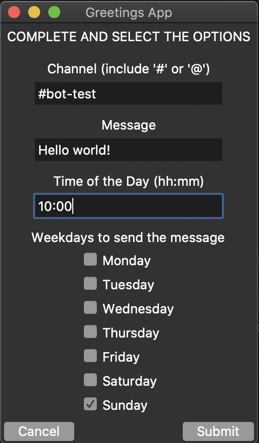
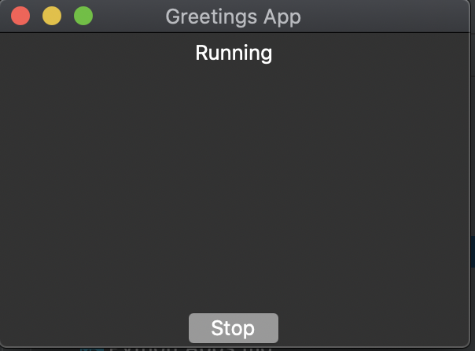
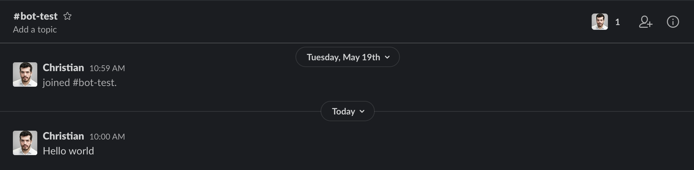
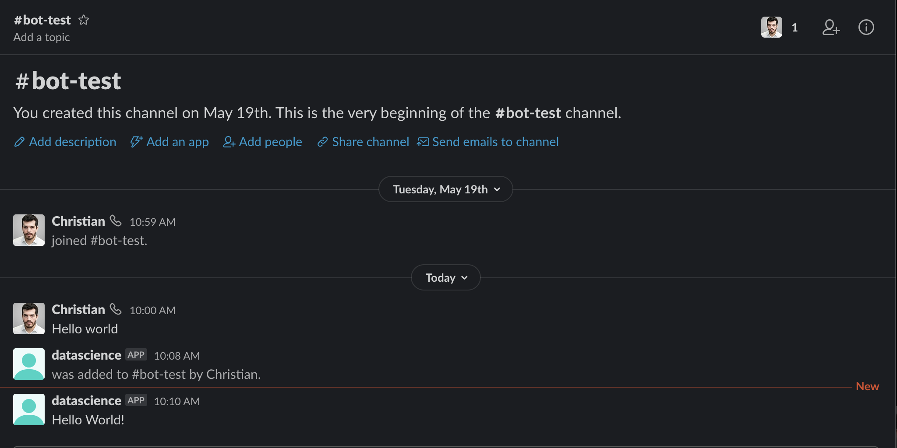

# A simple app to send messages to Slack

Here is a simple implementation of an app to send a pre-defined messages to a slack user or channel on a specific time on selected dates.

The app makes use of [`slackclient`](https://pypi.org/project/slackclient/) and [`schedule`](https://pypi.org/project/schedule/) to schedule periodic messages to Slack. And `tkinter` to create a simple user interface for the app.


## Pre-requisites 

### Slack API
You must create an app within Slack (Slack API) and install it in your workspace. The app is needed to define the type of "rights/actions" you would be able to perform using the Slack API, for this app is sufficient to have `chat:write` permissions, if you already have an app that has that functionality enabled, you just need to get its token to use this app. Otherwise, if you need help creating your own app in Slack I've written an example [here](https://www.christiancardone.com/app-to-send-messages-to-a-slack-channel-using-python.html#app-to-send-messages-to-a-slack-channel-using-python).

#### Token
o to `tokens/key.json` and add your token from your slack app.
```text
slack_app
|-slack_app
|-tokens
    |-key.json
|-License
|-README.md
|-morning_app.py
```

Change the text `<your-key-token-here>` with your own key
```text
{
	"API_TOKEN": "<your-key-token-here>"
}
```

### Tcl/Tk
Check that tkinter is properly installed in your system:
```commandline
python -m tkinter
``` 
My system has the 8.6 version of Tcl/Tk.

### Package dependencies
Go to the project directory open the console and run:
```commandline
pip install -r requirements.txt
```
I'm using Python 3.8.2, so make sure you have at least 3.8 or a higher version (for example threading module was optional for Python 3.7, and it's been used in this project)


## Running the App
Go to the main directory of the project and execute the `morning_app.py` file.
```commandline
pyton morning_app.py
```
A window will pop up requesting:  
- Channel: the name name of channel or user that will receive the messages (include "#" or "@" accordingly). Example **#bot-test**  
- Message: the text you want to share. Example **Hello world**  
- Time of the Day: The time you want the message to be sent in `hh:mm` format. Example **10:00** this will send the message at 10am (if you want 10 pm instead, write 22:00)  
- Weekdays to send the Message: Select all the days you want the same message to be sent. Example **We will send it every Sunday**  



After selecting your options click `Submit`.

A new window will pop up indicating that the program is running.



It will remain running until you stop it. For example if you marked "Tuesday" in your options, it will send the message every Tuesday until you stop the app.

If you added your user key you should see something like:



If you added the bot token:



Feel free to play with the project as you wish, for example you can use it as template to create more advanced/interesting automation projects.


